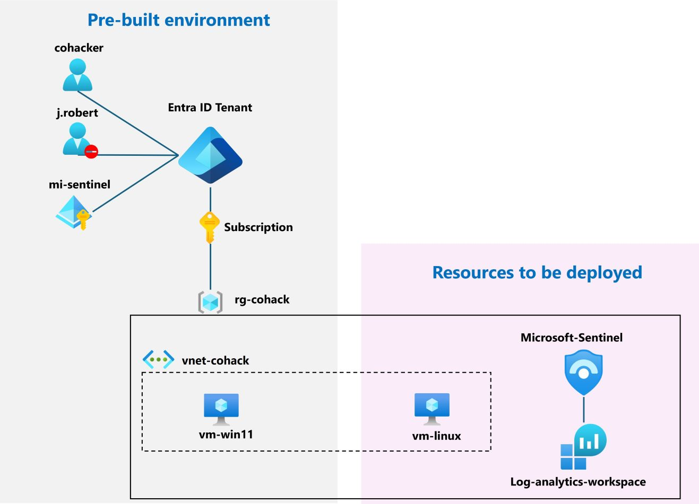

# Microsoft Sentiel Unveiled

## Goal

You are members of the Contoso SOC (Security Operation Center) team. Contoso aims to modernize its SIEM/SOAR solutions, and the CISO has learned about Microsoft Sentinel. To assess its capabilities, the CISO has assigned you to lead the development of a Proof of Concept (PoC). The objective is to evaluate how Microsoft Sentinel efficiently **collects logs** and **threat indicators**, **automatically detects incidents**, and **responds** to them.

Are you ready to embrace this challenge?

## Environment 

- Entra ID tenant with 2 users:
  - **cohacker**: user account to connect to Azure to run the Co-Hack
  - **j.robert**: Disabled user account, will be used to generate events
  - **mi-sentinel**: Managed identity, will be used in policies and Logic APP. 
- subscription:
  - Resource Group **rg-cohack**
  - Windows11 VM **vm-win11**
  - Vnet **vnet-cohack**

>**Note**: Deploy all resources in the resource group "rg-cohack",in the same region of the existing resources.

## Hacking Steps

1. Connect to Azure using **cohacker** user account. Your coach will provide you the password's account.

2. Deploy Microsoft Sentinel with a new log analytics workspace.

3. Connect the following Logs/Data Sources 
   - Azure Activity logs
   - Microsoft Entra ID sign-in logs
   - Windows Security Event for vm-win11
   - Micrsooft Defender Threat Intelligence 
   >**Notes**: 
   >  - You will need first to install solutions from content hub.
   >  - Use the managed identity to apply the policy remediation.

4. Create analytics rule to detect automatically the following incidents:
   - Creation of expensive computes in Azure,i.e, every Azure VM using more than 16vcpu.
   - Attempts to sign in to disabled accounts.
   - Security Event log cleared on Windows VM.
   - SigninLogs matching an IP entity belonging to threat indicators of compromise

    >**Notes**: 
    >  - Use the rule templates 
    >  - Use NRT rules whenever is possible.
    >  - The scheduled rules frequency should be reduced to 5 minutes.
    >  - To detect VM using 16vcpu, you will need to modify the detection query.

5. Generate Events:
   - Connect to **vm-win11** using RDP (the credentials will be provided by your coach), copy and run the provided script **Clear_Event_Viewer_Logs.bat** to clear all event logs.
   
   - On a browser private window, sign in with **j.robert** user account (the password will be provided by your coach) to access to:
    
      - Azure portal: **https://portal.azure.com**
      
      - Outlook: **https://outlook.office.com**
      - Microsoft 365: **https://microsoft365.com**
   
   - On Azure subcription, create a linux VM **vm-linux** with the size **D16s_v5**.   

6. On Azure subscription, deploy the Playbook (Logic APP) **IsolateAzureVMtoNSG.json** using the provided bicep template.

   >**Note**: Use the managed identity for API connection

7. Respond to the incident **Security Event log cleared** by isolating the **vm-win11** using the deployed Playbook.

8. Confirm that sentinel has received some indicators of compromise.
  

## Resources

- Quickstart, Onboard Microsoft Sentinel
: https://learn.microsoft.com/en-us/azure/sentinel/quickstart-onboard
- Tutorial, Detect threats by using analytics rules in Microsoft Sentinel: https://learn.microsoft.com/en-us/azure/sentinel/tutorial-log4j-detection
- Tutorial, Respond to threats by using playbooks with automation rules: https://learn.microsoft.com/en-us/azure/sentinel/tutorial-respond-threats-playbook?tabs=LAC%2Cincidents
- 

